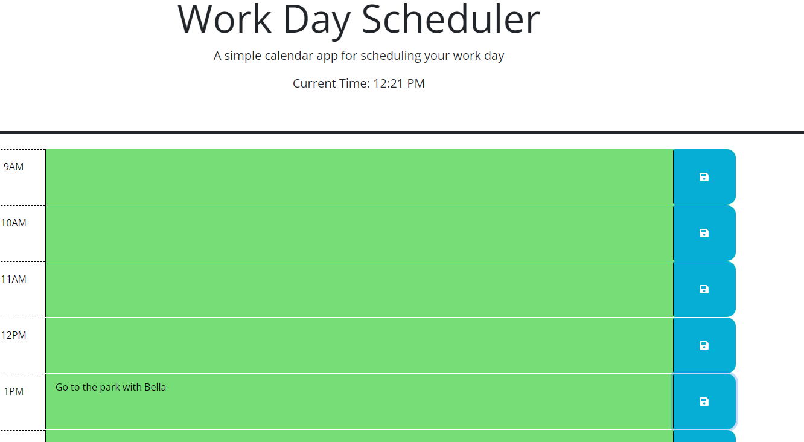

# work-flow-guru'

- Motivation 

    - To create a functional word day scheduler that allows the user to mark off time

- Project reason

    - So that I could keep track of my daily schedule

- What Problem does it solve

    - Stops you from losing your schedule when the window closes

- Deployable Link

    - https://simonhorrabin.github.io/work-flow-guru/

- Usage/Screenshot

